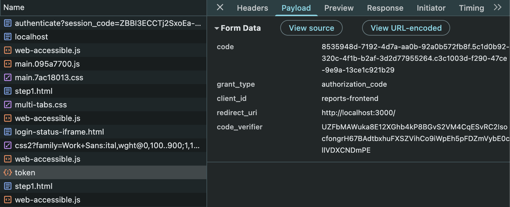
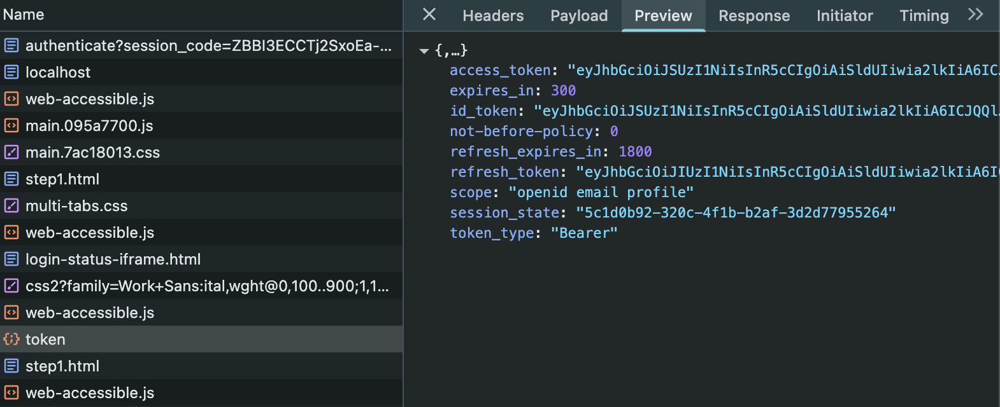
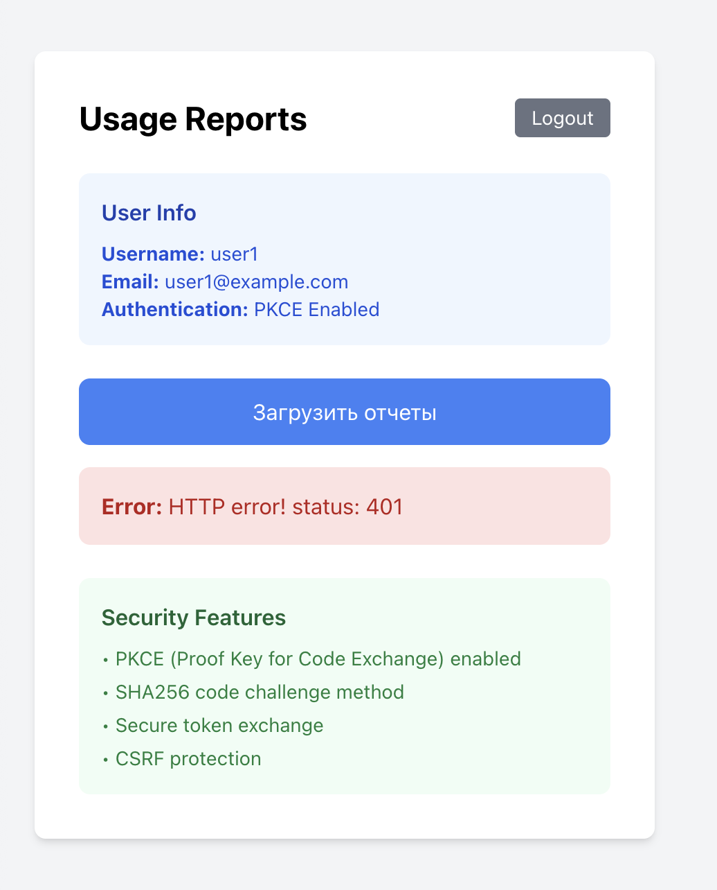
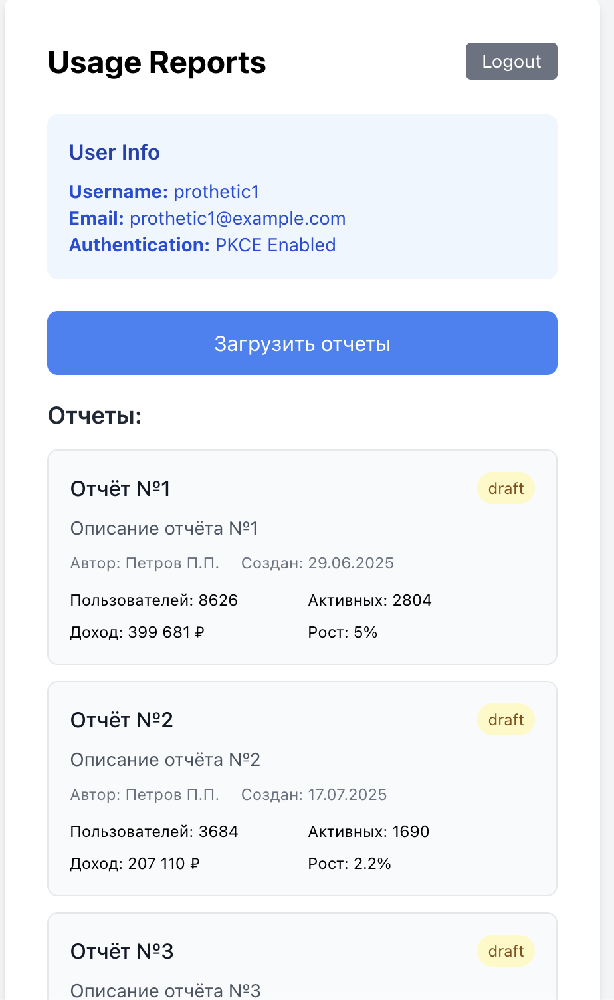

# Reports App with PKCE

Приложение отчетов с безопасной аутентификацией через Keycloak + PKCE.

## Запуск

```bash
docker-compose up -d
```

**URLs:**
- Frontend: http://localhost:3000
- Keycloak: http://localhost:8080 (admin/admin)

## Структура

```
s8/
├── frontend/                 # React + TypeScript + Tailwind
│   ├── src/
│   │   ├── utils/
│   │   │   ├── pkce.ts      # PKCE утилиты (code verifier/challenge)
│   │   │   └── keycloakWithPKCE.ts  # Кастомный Keycloak с PKCE
│   │   ├── components/
│   │   │   ├── ReportPage.tsx       # Главная страница с отчетами
│   │   │   └── AuthCallback.tsx     # Обработка OAuth callback
│   │   └── App.tsx
│   └── public/silent-check-sso.html # SSO проверка
├── backend/                  # PHP API
│   └── index.php            # JWT валидация + отчеты
├── keycloak/
│   └── realm-export.json    # Realm конфигурация
└── docker-compose.yaml
```

## PKCE Реализация

### Что это:
PKCE (Proof Key for Code Exchange) - защита от атак перехвата authorization code.

### Как работает:
1. **Генерация** случайного code verifier (128 символов)
2. **Создание** code challenge через SHA256 хеш
3. **Отправка** challenge в Keycloak при логине
4. **Обмен** authorization code на токены с verifier

### Код:
```typescript
// pkce.ts - генерация verifier/challenge
export async function setupPKCE(): Promise<{ codeVerifier: string; codeChallenge: string }>

// keycloakWithPKCE.ts - интеграция с Keycloak
class KeycloakWithPKCE extends Keycloak {
  login() // добавляет PKCE параметры
  exchangeCode() // обмен с code verifier
}
```

### Безопасность:
- ✅ SHA256 code challenge (S256)
- ✅ Случайный code verifier
- ✅ Одноразовое использование
- ✅ CSRF защита

## Как работает PKCE

### Принцип защиты:
1. **Генерация** случайного code verifier (128 символов)
2. **Создание** code challenge через SHA256 хеш
3. **Логин** - отправляем challenge в Keycloak
4. **Callback** - получаем authorization code
5. **Обмен** - отправляем code + verifier, получаем токены

### Поток данных:
```
verifier → SHA256 → challenge → Keycloak
code ← Keycloak
code + verifier → Keycloak → tokens
```

### Защита от атак:
- Атакующий может перехватить authorization code
- **НО** не знает code verifier
- Keycloak проверяет: `SHA256(verifier) == challenge`
- Без правильного verifier обмен не проходит


## Результаты
### Запрос токена

### Ответ

### Запрос отчетов обычным пользователем

### Запрос отчетов пользователя с ролью prothetic_user

